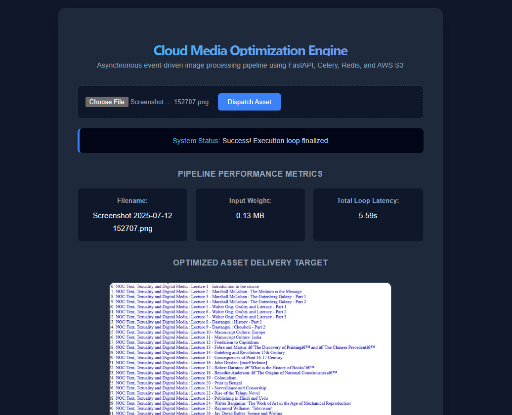

# Cloud-Native Distributed Media Optimization Engine

A decoupled, event-driven asynchronous task processing pipeline engineered to ingest, compress, and deliver user media assets globally. This architecture isolates heavy image mutation workloads from the main web runtime to ensure blazing fast response times and zero user-interface slowdowns under heavy traffic loads.

---

## 🛠️ System Architecture Blueprint

* **Frontend UI:** Single Page Application built with React and Vite, utilizing dynamic status polling to track real-time processing lifecycles.
* **API Gateway Service:** FastAPI (Python) web gateway that streams raw incoming assets directly to cloud storage and handles initial task registration.
* **Message Broker:** Dockerized Redis managing a resilient, FIFO (First-In, First-Out) enterprise task queue.
* **Asynchronous Worker Pool:** Celery background worker nodes executing out-of-process, high-compute image manipulation.
* **Image Processing Engine:** Pillow core binary processing for downscaling and JPEG matrix quality optimization.
* **Transactional Tracking:** SQLAlchemy ORM coupled with a transactional SQLite state persistence ledger.
* **Cloud Infrastructure:** AWS S3 object storage configured with granular public bucket policies for low-latency asset delivery.

---

## 🚀 Local Installation & Deployment

### 1. Clone the Workspace
git clone https://github.com/shriya-gakkhar1/cloud-media-optimization-pipeline.git
cd cloud-media-optimization-pipeline

### 2. Spin Up the Message Broker Container
Ensure Docker Desktop is running, then boot up the Redis broker container in detached mode:
docker-compose up -d

### 3. Initialize and Configure the Backend Service
cd backend
python -m venv venv

# Windows PowerShell environment activation:
.\venv\Scripts\Activate

# Install project dependencies:
python -m pip install -r requirements.txt

Create a .env file inside the backend/ directory using the structural layout specified in .env.example and add your production AWS credentials.

### 4. Boot the FastAPI Cluster
python -m uvicorn main:app --reload

### 5. Launch the Celery Asynchronous Workers
Open a secondary terminal tab inside the backend directory, activate your virtual environment, and run:
python -m celery -A tasks.celery_app worker --loglevel=info -P solo

### 6. Initialize the Frontend UI Dashboard
Open a third terminal window inside the root project folder and run:
cd frontend
npm install
npm run dev

Open http://localhost:5173 in your web browser to experience the live cloud media pipeline loop!

---

## 📄 License
Distributed under the MIT License. See the LICENSE file for full licensing terms.
