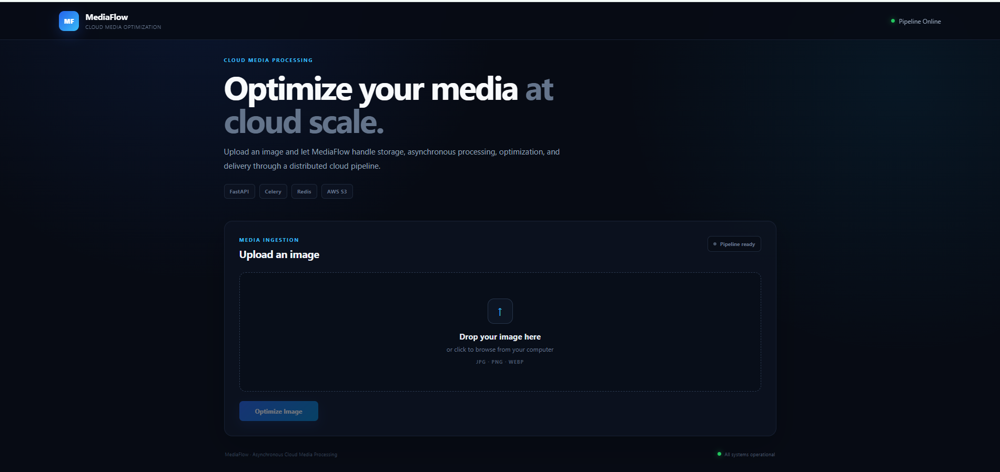
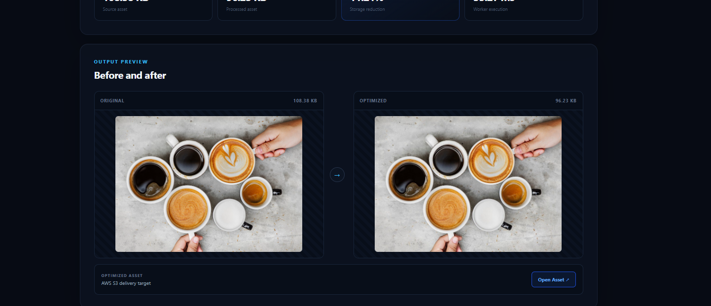

# MediaFlow — Cloud Native Media Processing Platform

A cloud based asynchronous media processing platform designed to ingest, optimize, store, and deliver image assets efficiently.

MediaFlow separates image processing from the main API request using FastAPI, Redis, and Celery. Uploaded images are stored in Amazon S3, processed asynchronously by background workers, optimized using Pillow, and returned through secure presigned URLs.

---

## ✨ Features

- Asynchronous image processing using Celery workers
- Redis based task queue
- FastAPI REST API
- Image optimization and compression using Pillow
- Amazon S3 object storage
- Secure presigned URLs for optimized asset delivery
- Processing status tracking
- Original and optimized file size tracking
- Compression percentage calculation
- Processing time measurement
- SQLAlchemy based database persistence
- React and Vite frontend
- Dockerized Redis for local development
- PostgreSQL compatible backend configuration

---

## 🏗️ System Architecture

```text
                         ┌──────────────────────┐
                         │   React + Vite UI    │
                         └──────────┬───────────┘
                                    │
                              POST /upload
                                    │
                                    ▼
                         ┌──────────────────────┐
                         │      FastAPI         │
                         │     REST API         │
                         └──────────┬───────────┘
                                    │
                         ┌──────────┴──────────┐
                         │                     │
                         ▼                     ▼
                ┌────────────────┐    ┌────────────────┐
                │    AWS S3      │    │   Database     │
                │ Original Asset │    │ Task Metadata  │
                └───────┬────────┘    └────────────────┘
                        │
                        │ Task Dispatch
                        ▼
                ┌────────────────┐
                │     Redis      │
                │  Task Broker   │
                └───────┬────────┘
                        │
                        ▼
                ┌────────────────┐
                │ Celery Worker  │
                │                │
                │    Pillow      │
                │ Image Optimize │
                └───────┬────────┘
                        │
                        ▼
                ┌────────────────┐
                │     AWS S3     │
                │ Optimized Asset│
                └───────┬────────┘
                        │
                  Presigned URL
                        │
                        ▼
                ┌────────────────┐
                │   React UI     │
                │ Result + Stats │
                └────────────────┘

## 📸 Application Screenshots

### MediaFlow Processing Dashboard

The frontend provides an interactive interface for uploading media assets, monitoring asynchronous processing status, and viewing optimization results and performance metrics.



### Optimized Asset & Performance Metrics

After processing, the dashboard displays the optimized image along with the original file size, optimized file size, compression percentage, and processing latency.


🛠️ Technology Stack
Frontend
React.js
Vite
JavaScript
CSS
REST API integration
Backend
Python
FastAPI
SQLAlchemy
Pydantic
Uvicorn
Asynchronous Processing
Celery
Redis
Pillow
Cloud
Amazon S3
AWS IAM
Presigned S3 URLs
Database
SQLite for local development
PostgreSQL compatible through SQLAlchemy
DevOps
Docker
Docker Compose
Git
GitHub
🔄 Processing Workflow
1. Upload

The user selects an image from the React frontend.

The frontend sends the image to:

POST /upload
2. S3 Ingestion

FastAPI generates a unique job ID and uploads the original image to Amazon S3.

A database record is created with the initial processing status.

3. Task Dispatch

FastAPI dispatches the image processing task to Celery through Redis.

The API immediately returns the task ID instead of waiting for image optimization to finish.

4. Background Processing

A Celery worker retrieves the task and processes the image using Pillow.

The worker:

Downloads the original image from S3
Optimizes the image
Calculates file size changes
Measures processing time
Uploads the optimized asset back to S3
Updates the processing record
5. Status Tracking

The frontend periodically checks:

GET /status/{task_id}

The API returns the current processing state.

Possible states include:

PROCESSING
COMPLETED
FAILED
6. Optimized Asset Delivery

Once processing is complete, the backend generates a secure presigned S3 URL.

The frontend uses this URL to display the optimized image.

📊 Processing Metrics

MediaFlow tracks performance information for every processing task.

Example:

Original Size:        87.85 KB
Optimized Size:       73.31 KB
Compression:          16.55%
Processing Time:      89.68 ms
Status:               COMPLETED

These metrics allow the system to measure the effectiveness and latency of the optimization pipeline.

📁 Project Structure
cloud-media-optimization-pipeline/
│
├── backend/
│   ├── main.py
│   ├── tasks.py
│   ├── celery_app.py
│   ├── config.py
│   ├── database.py
│   ├── db_models.py
│   ├── image_service.py
│   ├── s3_service.py
│   ├── schemas.py
│   ├── logger.py
│   ├── requirements.txt
│   └── test_s3.py
│
├── frontend/
│   ├── src/
│   │   ├── App.jsx
│   │   ├── App.css
│   │   ├── index.css
│   │   └── main.jsx
│   ├── package.json
│   └── vite.config.js
│
├── docker-compose.yml
├── .gitignore
├── LICENSE
└── README.md
🚀 Local Setup
Prerequisites

Make sure the following are installed:

Python 3
Node.js and npm
Docker Desktop
Git
AWS account with an S3 bucket
1. Clone the Repository
git clone https://github.com/shriya-gakkhar1/cloud-media-optimization-pipeline.git
cd cloud-media-optimization-pipeline
2. Start Redis

Make sure Docker Desktop is running.

Start the Redis container:

docker-compose up -d

Verify that Redis is running:

docker ps

Redis will be available locally on:

localhost:6379
3. Configure the Backend

Open a terminal in the backend directory:

cd backend

Create a virtual environment:

python -m venv .venv
Windows PowerShell
.\.venv\Scripts\Activate.ps1

Install dependencies:

pip install -r requirements.txt

Create:

backend/.env

Add the required configuration:

AWS_ACCESS_KEY=your_aws_access_key
AWS_SECRET_KEY=your_aws_secret_key
AWS_REGION=ap-south-1
S3_BUCKET=your_s3_bucket_name

DATABASE_URL=sqlite:///./mediaflow.db

REDIS_URL=redis://localhost:6379/0

Never commit .env or AWS credentials to GitHub.

4. Start FastAPI

From the backend directory:

uvicorn main:app --reload

The API will be available at:

http://127.0.0.1:8000

Interactive API documentation:

http://127.0.0.1:8000/docs
5. Start the Celery Worker

Open a second terminal.

Navigate to the backend:

cd backend

Activate the virtual environment:

.\.venv\Scripts\Activate.ps1

Start Celery:

celery -A celery_app.celery_app worker --pool=solo --loglevel=info

The worker connects to Redis and waits for image processing tasks.

6. Start the Frontend

Open a third terminal:

cd frontend

Install dependencies:

npm install

Start the Vite development server:

npm run dev

The frontend will be available at:

http://localhost:5173
🔌 API Endpoints
Upload Image
POST /upload

Uploads an image to S3 and creates an asynchronous processing task.

Example response:

{
  "success": true,
  "message": "Image uploaded successfully.",
  "data": {
    "task_id": "6597df04-87ee-4435-9545-888a82c4246e",
    "status": "PROCESSING"
  }
}
Check Processing Status
GET /status/{task_id}

Returns processing status and optimized asset information.

Example:

{
  "success": true,
  "data": {
    "task_id": "6597df04-87ee-4435-9545-888a82c4246e",
    "status": "COMPLETED",
    "optimized_url": "https://..."
  }
}
🔐 Security

MediaFlow keeps AWS credentials outside the source code using environment variables.

Optimized assets are accessed through presigned S3 URLs rather than exposing AWS credentials to the frontend.

Sensitive files are excluded from Git using .gitignore.

Never commit:

.env
AWS credentials
database files
node_modules
Python cache files
📈 Example Pipeline Result

A successful processing lifecycle looks like:

Image Selected
      ↓
Upload to FastAPI
      ↓
Store Original in S3
      ↓
Create Processing Task
      ↓
Redis Queue
      ↓
Celery Worker
      ↓
Pillow Optimization
      ↓
Upload Optimized Image to S3
      ↓
Update Database
      ↓
Generate Presigned URL
      ↓
Frontend Displays Optimized Asset
🧪 Testing

The complete pipeline has been tested locally across:

React Frontend
        ↓
FastAPI
        ↓
Redis
        ↓
Celery
        ↓
Pillow
        ↓
AWS S3
        ↓
Database

Example successful processing:

Status: COMPLETED
Processing Time: 89.68 ms
Compression: 16.55%
📌 Project Highlights
Designed an event driven asynchronous media processing architecture
Decoupled image processing from the API request lifecycle
Implemented background task processing using Celery and Redis
Integrated AWS S3 for cloud object storage
Implemented secure presigned asset delivery
Added task level processing and performance metrics
Built a React frontend for monitoring processing status
Added PostgreSQL compatibility for future cloud deployment
Containerized Redis for reproducible local development
📄 License

Distributed under the MIT License. See the LICENSE file for full licensing terms.


Then just run:


git add README.md
git commit -m "docs: update MediaFlow documentation"
git push origin main
